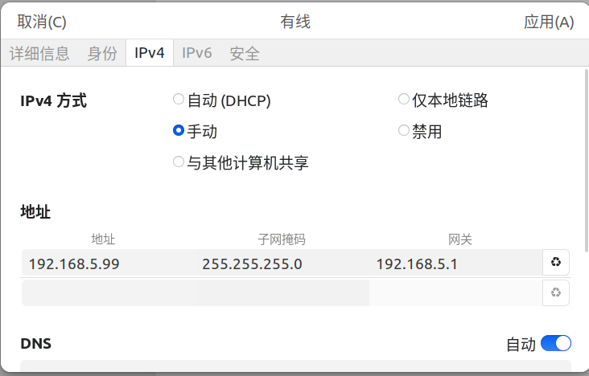

## 在PC上配置IP

在PC与开发板连接好后，可以使用`ifconfig`查看到网卡信息:

```bash
ifconfig

# enx00e099a751b1: flags=4163<UP,BROADCAST,RUNNING,MULTICAST>  mtu 1500
#         ether 00:e0:99:a7:51:b1  txqueuelen 1000  (以太网)
#         RX packets 0  bytes 0 (0.0 B)
#         RX errors 0  dropped 0  overruns 0  frame 0
#         TX packets 80  bytes 14726 (14.7 KB)
#         TX errors 0  dropped 0 overruns 0  carrier 0  collisions 0
```

这个还没有IP信息的就是我们要找的，打开设置，找到有线网络，点击`齿轮`图标：


IPv4方式选择手动，自己配置IP地址，子网掩码写固定`255.255.255.0`就好，其他可以自己配置，但要遵循规则，如若不懂，则按照下图配置：



## 在开发板上的U-Boot配置IP

如若开发板的`bootdelay`不为0的话，可在`uboot`阶段按下`空格`或`s`打断引导，如果`bootdelay`为0，则复位时狂按`s`：

```bash
=> setenv ipaddr 192.168.5.88
=> setenv gatewayip 192.168.5.1
=> setenv netmask 255.255.255.0
=> saveenv
=> ping 192.168.5.99
# ethernet@cac80000 Waiting for PHY auto negotiation to complete..... done
# emac_adjust_link link:1 speed:100 duplex:full
# Using ethernet@cac80000 device
# host 192.168.5.99 is alive

```

## PC搭建TFTP

安装软件包：

```bash
sudo apt-get install tftp-hpa tftpd-hpa xinetd
```

设置`tftp`目录：

```bash
mkdir -p <your_path>/tftp
# 不授予权限的话tftp无法访问
chmod 777 <your_path>/tftp
# 创建一个测试文件 一会tftp下载测试
touch <your_path>/tftp/1
```

配置`tftp`:

```bash
sudo mkdir -p /etc/xinetd.d/ && sudo vim /etc/xinetd.d/tftp

# 将下面内容写入
server tftp
{
        socket_type = dgram
        protocol = udp
        wait = yes
        user = root
        server = /usr/sbin/in.tftpd
        server_args = -s <your_path>/tftp/
        disable = no
        per_source = 11
        cps = 100 2
        flags = IPv4
}

sudo service tftpd-hpa start && sudo vim /etc/default/tftpd-hpa

# 将下面内容写入

# /etc/default/tftpd-hpa

TFTP_USERNAME="tftp"
TFTP_DIRECTORY="<your_path>/tftp/"
TFTP_ADDRESS=":69"
TFTP_OPTIONS="-l -c -s"
```

重启`TFTP`服务器：

```bash
sudo service tftpd-hpa restart
```

`uboot`测试：

```bash
=> tftpboot 0x10000000 192.168.5.99:1

# ethernet@cac80000 Waiting for PHY auto negotiation to complete... done
# emac_adjust_link link:1 speed:100 duplex:full
# Using ethernet@cac80000 device
# TFTP from server 192.168.5.99; our IP address is 192.168.5.88
# Filename '1'.
# Load address: 0x10000000
# Loading: #
#          0 Bytes/s
# done
```

这样来回输入`IP`还是太麻烦了，让我们来配置一下`TFTP`的服务器`IP`：

```bash
=> setenv serverip 192.168.5.99
=> saveenv

=> tftpboot 0x10000000 1             
# ethernet@cac80000 Waiting for PHY auto negotiation to complete..... done
# emac_adjust_link link:1 speed:100 duplex:full
# Using ethernet@cac80000 device
# TFTP from server 192.168.5.99; our IP address is 192.168.5.88
# Filename '1'.
# Load address: 0x10000000
# Loading: #
#          0 Bytes/s
# done
```

