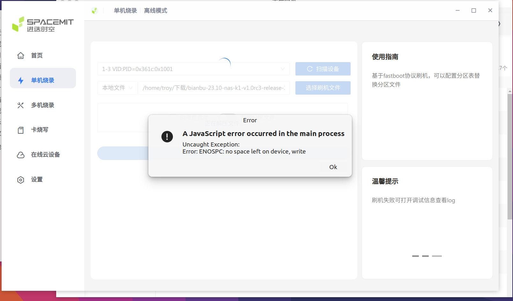

## 开始

https://docs.banana-pi.org/en/BPI-F3/BananaPi_BPI-F3

https://docs.banana-pi.org/en/BPI-F3/GettingStarted_BPI-F3

## titantools在linux可能遇到的问题

在选择镜像压缩包后，弹出以下报错信息：



初步推测是分区不足：

```bash
df -h

# tmpfs           766M  2.1M  764M    1% /run
# /dev/nvme0n1p2  938G   65G  825G    8% /
# tmpfs           3.8G  154M  3.6G    5% /dev/shm
# tmpfs           5.0M  4.0K  5.0M    1% /run/lock
# efivarfs        128K   89K   35K   72% /sys/firmware/efi/efivars
# tmpfs           3.8G     0  3.8G    0% /run/qemu
# /dev/nvme0n1p1  511M  6.1M  505M    2% /boot/efi
# tmpfs           766M  766M     0  100% /run/user/1000
```

在不丢失数据的情况下给/run/user/1000扩容：

```bash
sudo mount -o remount,size=4G /run/user/1000
```

