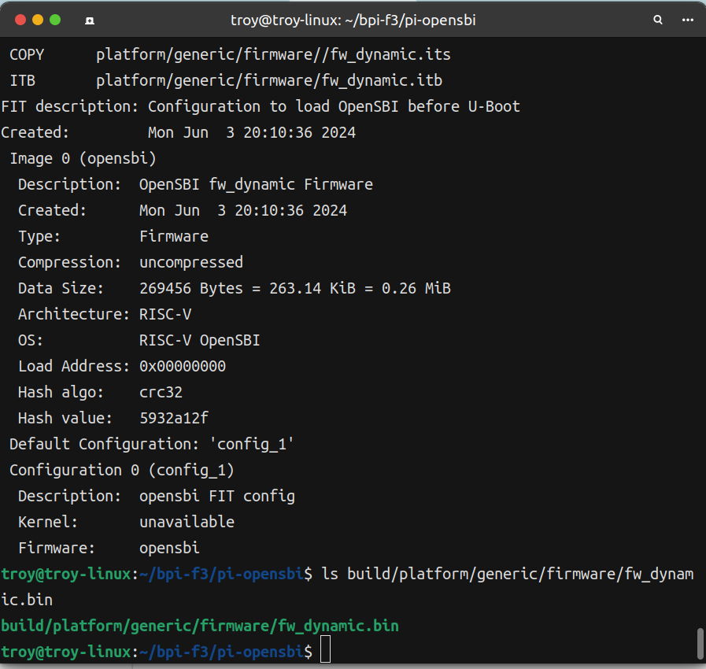
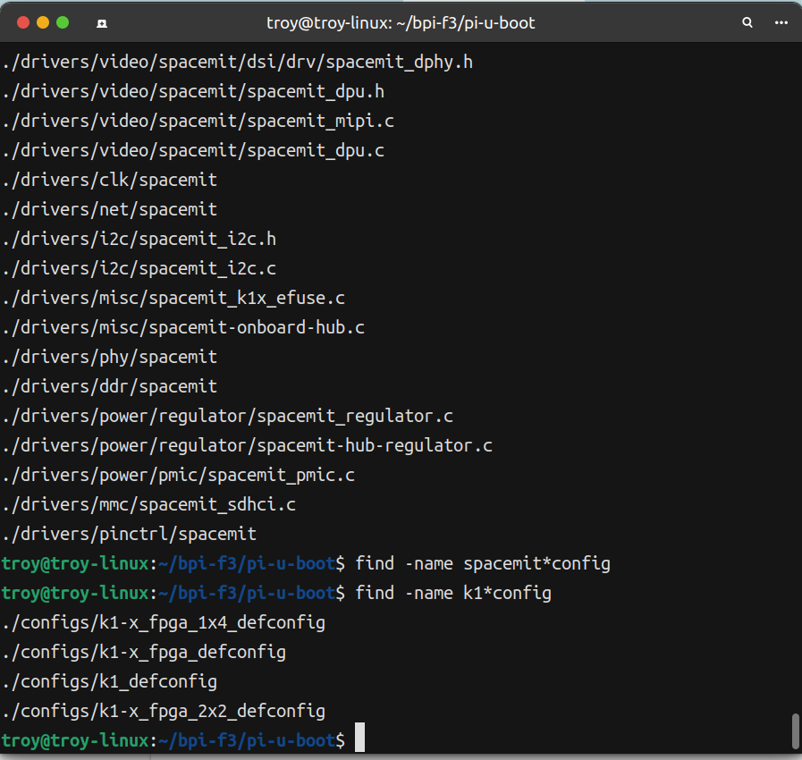

## 环境

```bash
$ sudo apt-get update && sudo apt-get upgrade
$ sudo apt-get install gcc clang rustc bindgen make flex bash  bison pahole mount jfsutils reiserfsprogs xfsprogs  btrfs-progs pcmciautils quota ppp nfs-common grub2-common udev python3-sphinx global build-essential libncurses-dev bison flex libssl-dev libelf-dev bc u-boot-tools
```

你还需要一个针对riscv平台的gcc工具链:https://github.com/riscv-collab/riscv-gnu-toolchain

## 编译open-sbi

要构建uboot，首先需要构建opensbi。

首先获取源码:

```bash
git clone git@github.com:BPI-SINOVOIP/pi-opensbi.git && cd pi-opensbi
```

切换到k1芯片所对应的分支:

```bash
git checkout v1.3-k1
```

查找一下spacemit所对应的平台名称:

```bash
find -name spacemit*

# ./build/platform/generic/kconfig/platform/spacemit
# ./build/platform/generic/spacemit
# ./build/platform/generic/spacemit/spacemit_k1.dep
# ./include/sbi_utils/psci/plat/arm/board/spacemit
# ./platform/generic/include/spacemit
# ./platform/generic/include/spacemit/spacemit_config.h
# ./platform/generic/spacemit
# ./platform/generic/spacemit/spacemit_k1.c
# ./lib/utils/psci/spacemit
# ./lib/utils/psci/spacemit/spacemit_topology.c
# ./lib/utils/arm_scmi/board/spacemit
# ./lib/utils/arm_scmi/board/spacemit/spacemit_pm.c
```

看来spacemit K1的文件位于platform/generic目录中，因此使用以下命令来构建opensbi:

```bash
make CROSS_COMPILE=riscv64-unknown-linux-gnu- PLATFORM=generic -j16
```

遇到了如下错误，看起来是k1pro的问题，但问题是我们编译的是k1平台下，看来要menuconfig了。


幸运的是，我在这里找到了解决方案:https://github.com/BPI-SINOVOIP/pi-opensbi/issues/1

按照issue的指导，再次进行编译，得到成功结果，固件路径为build/platform/generic/firmware/fw_dynamic.bin



将该文件导出为OPENSBI，uboot编译要用到:

```bash
export OPENSBI=<your-open-sbi-path>/build/platform/generic/firmware/fw_dynamic.bin
```

## 编译uboot

获取uboot源码:

```bash
git clone git@github.com:BPI-SINOVOIP/pi-u-boot.git && cd pi-u-boot && git checkout && git checkout v2022.10-k1
```

通过以下命令可以得知到config的名称:

```bash
find -name k1*config
```



所以通过以下命令进行编译uboot:

```bash
make ARCH=riscv CROSS_COMPILE=riscv64-unknown-linux-gnu- k1_defconfig && make ARCH=riscv CROSS_COMPILE=riscv64-unknown-linux-gnu- -j16
```

编译后在uboot目录下产生了如下文件

```bash
FSBL.bin bootinfo_emmc.bin  bootinfo_sd.bin  bootinfo_spinand.bin bootinfo_spinor.bin u-boot.itb
```

## 加载uboot

将以下文件放入U盘并插入到bpi-f3:

- FSBL.bin
- bootinfo_emmc.bin
- u-boot.itb

在bpi-f3上执行以下命令:

```bash
mount /dev/sda1 /mnt && cd /mnt

echo 0 > /sys/block/mmcblk2boot0/force_ro
dd if=bootinfo_emmc.bin of=/dev/mmcblk2boot0

dd if=FSBL.bin of=/dev/mmcblk2boot0 bs=512 seek=1
```

清空mmcblk2分区数据:

```bash
dd if=/dev/zero of=/dev/mmcblk2 bs=1M count=8
```

创建gpt分区表和uboot分区:

```bash
parted /dev/mmcblk2

(parted) mktable gpt
# 这里0%则是从0%处开始，因为GPT分区表大概占1M，所以结束位置用3M
# 即创建2M的分区 名字叫uboot
(parted) mkpart uboot 0% 3M
(parted) print                                                            
Model: MMC AJTD4R (sd/mmc)
Disk /dev/mmcblk2: 15.6GB
Sector size (logical/physical): 512B/512B
Partition Table: gpt
Disk Flags: 

Number  Start   End     Size    File system  Name   Flags
 1      1049kB  3146kB  2097kB               uboot
 
(parted) quit
```

使用以下命令写入uboot:

```bash
dd if=./u-boot.itb of=/dev/mmcblk2p1
```

现在拿掉sd卡，复位后可看到SPL和Uboot的输出，重点观察编译时间。